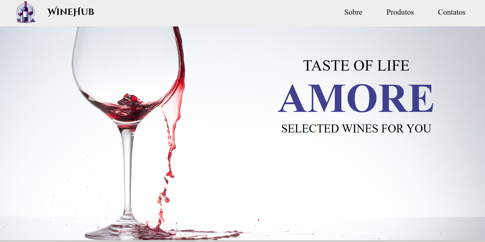

# 🍷 WineHub



Bem-vindo ao **WineHub**, um site elegante e funcional para explorar e comprar vinhos e acessórios relacionados!  
Desenvolvido com **HTML**, **CSS** e **JavaScript**, o projeto oferece uma experiência simples, intuitiva e agradável para os amantes de vinho.

---

## 🌟 Features

- Catálogo organizado com vinhos tintos, brancos e rosés 🍇  
- Seção de acessórios para vinho, como saca-rolhas e taças 🍾  
- Layout responsivo, adaptado para diferentes dispositivos 📱💻  
- Filtro por categorias para facilitar a busca  
- Carrinho de compras integrado  
- Visual limpo e moderno com foco na experiência do usuário  

---

## 🖥️ Demonstração Online

Você pode acessar o projeto ao vivo neste link:  
👉 [WineHub - Ao Vivo](https://caua-ricken.github.io/WineHub/)

---

## 🛠️ Tecnologias Utilizadas

- **HTML5**  
- **CSS3** (com variáveis e responsividade)  
- **JavaScript** (para interatividade, filtros e carrinho)  
- **GitHub Pages** (para hospedagem gratuita)

---

## 🚀 Como Executar Localmente

1. Clone o repositório:  
   ```bash
   git clone https://github.com/Dev-Caua-Ricken/WineHub.git
